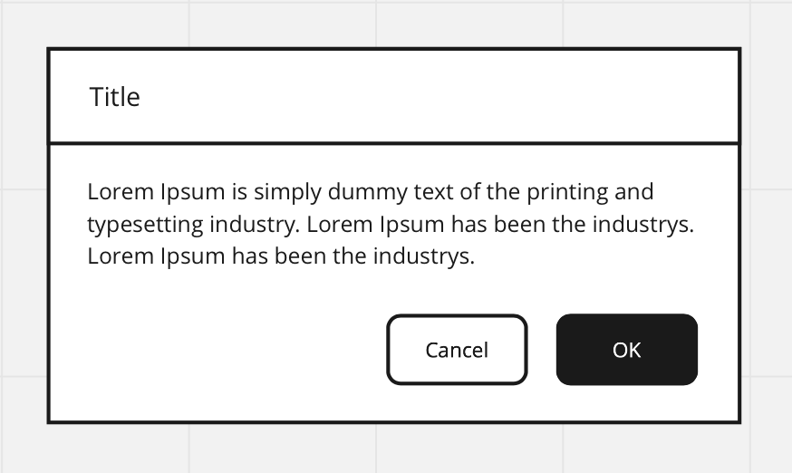

# Frontend Academy exercises

## Static HTML & CSS exercises

1. Do a custom styled button. Remember you can do at least `:hover`, `:focus`, `:active` and `:disabled` selectors to react to different states! You can also create a secondary version of it.
   1. [MDN's button article](https://developer.mozilla.org/en-US/docs/Web/HTML/Element/button) might be worth your while
   2. Extra credit: Read the accessibility section at the end of the page
2. Create an alert box (non-interactive will do for now). Use the button from the previous exercise.

## React exercises

1. Implement the button from static HTML exercise 1 as a React component
   1. Take into account the different states the button can be in
      1. Hint: Disabled probably needs to be implemented as a prop, whilst focus doesn't. Why?
   2. Create stories for the different styles
2. Implement the alert box from static HTML exercise 2 as a React component
   1. Create a new component that uses your button component
   2. Create stories for the alert box
   3. Make light and dark themes for the alert box
      1. It can be a prop that the component accepts, or if you like, you can [react to user's OS level preference](https://css-tricks.com/a-complete-guide-to-dark-mode-on-the-web/) (although it might still be wise to offer an override)
3. Create an `Input` component with your custom styles
   1. Create stories for at least the following states
      1. Normal
      2. Active
      3. Disabled
      4. Invalid
4. Extract common CSS values (think "design tokens") into a styled-component `theme`
   1. See `src/theme.ts` and an example usage of it in `src/components/Button.tsx`
5. Create a simple page, where you have your button and clicking it opens the alert box